# COMP90015-Distributed-Systems (2023-s1)

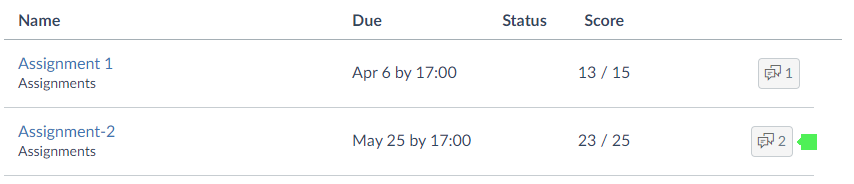

## Assignment 1 - Multi-threaded Dictionary Server

The system's user interface is built using **JavaFX**, which provides a modern and customizable platform for
creating rich and interactive desktop applications.

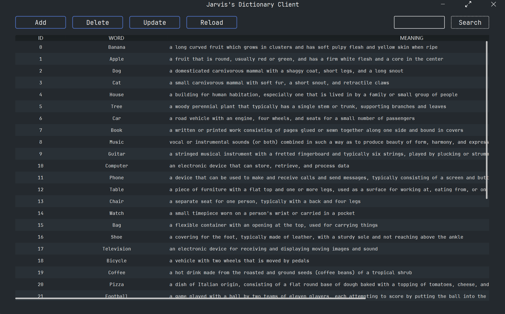

You can simply run the DictionaryServerApp and DictionaryClientApp classes to start the server and client applications.

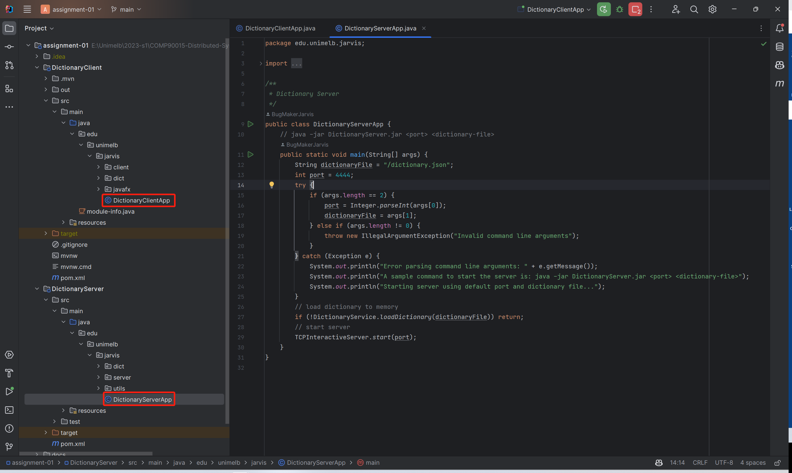

Here is the feedback.

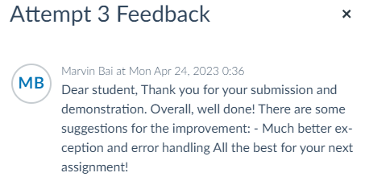

## Assignment 2 - Distributed Shared Whiteboard

Whiteboard Server

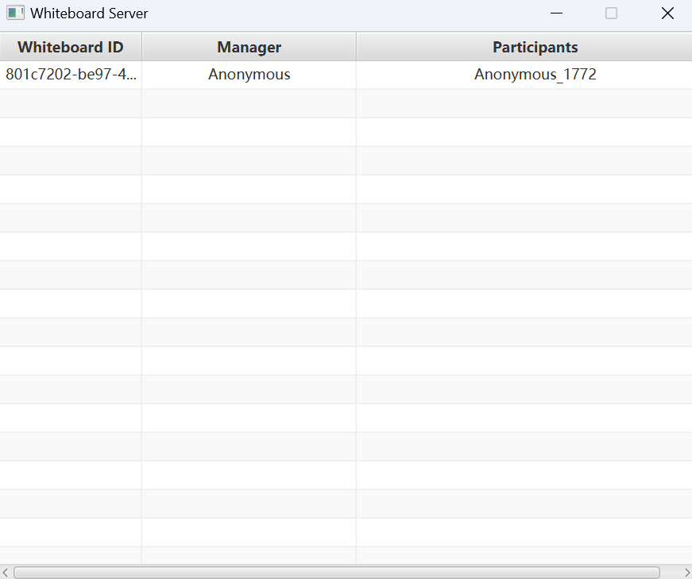

Whiteboard Client - Manager

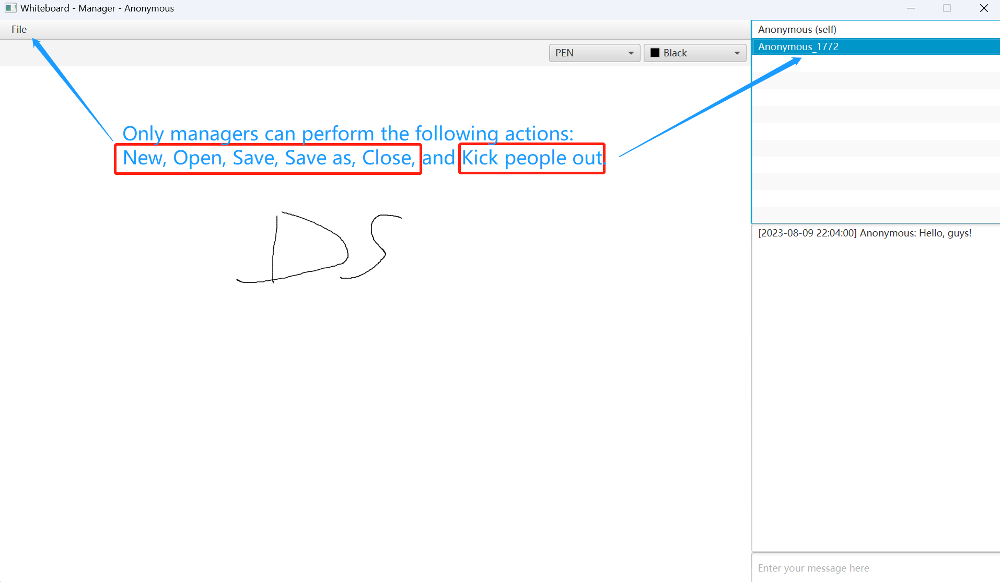

Whiteboard Client - Participant

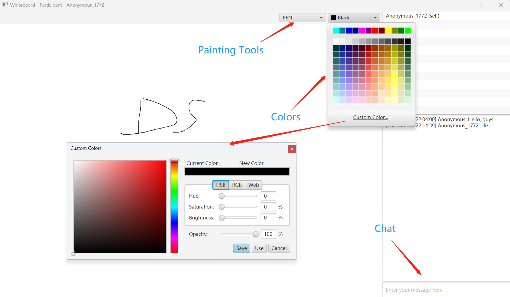

Just like the first assignment, you can simply run the ServerApplication, CreateApplication and JoinApplication to start the server, manager and participant applications.

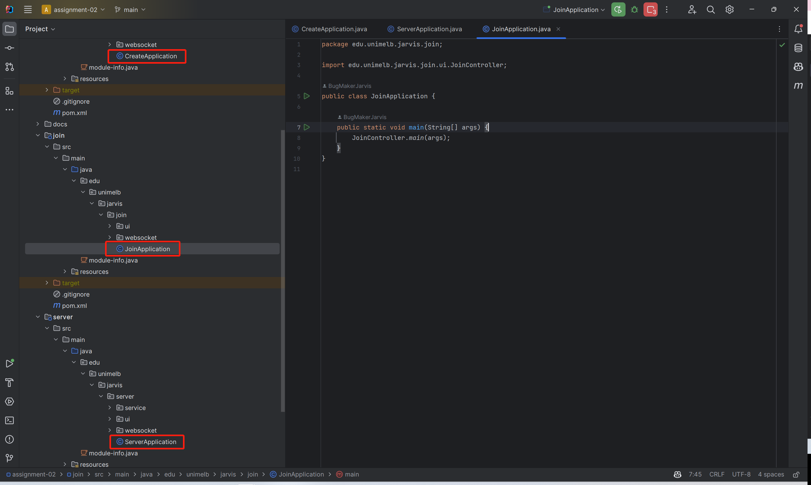

Here is the feedback.

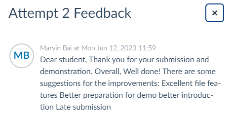

## How to package each module into a JAR file

The packaging method might differ from what the tutor taught, because both assignments used JavaFX to create the UI interface.

If you use IntelliJ IDEA, you can follow the steps below to package the module into a JAR file.

1. Open the project structure window, and select the Artifacts tab. Click the plus button and select JAR -> From modules with dependencies.

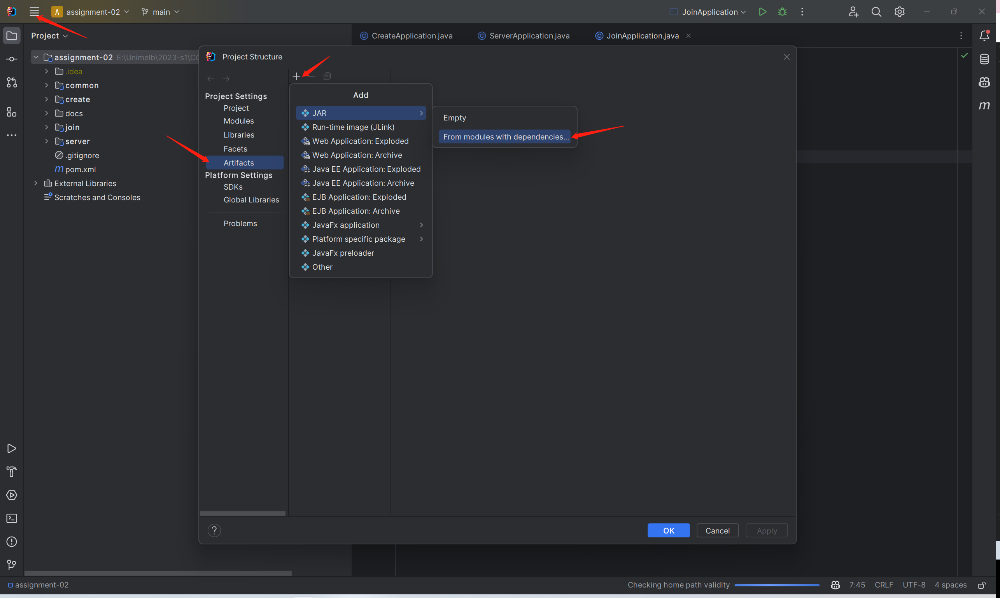

2. Select the main class of the module, and click OK.

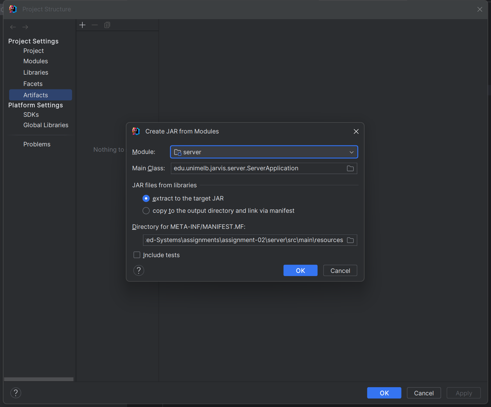

3. Click the build button and select Build Artifacts.

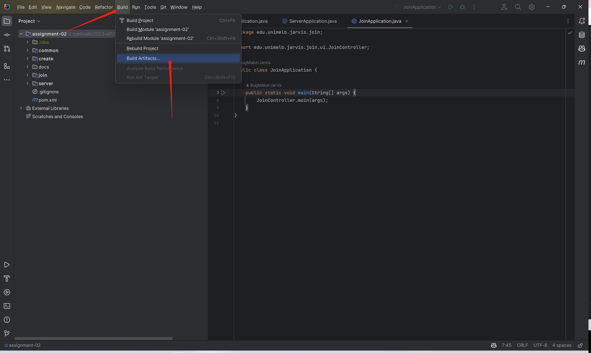

4. Click the build button and JAR file will be generated in the out/artifacts directory.

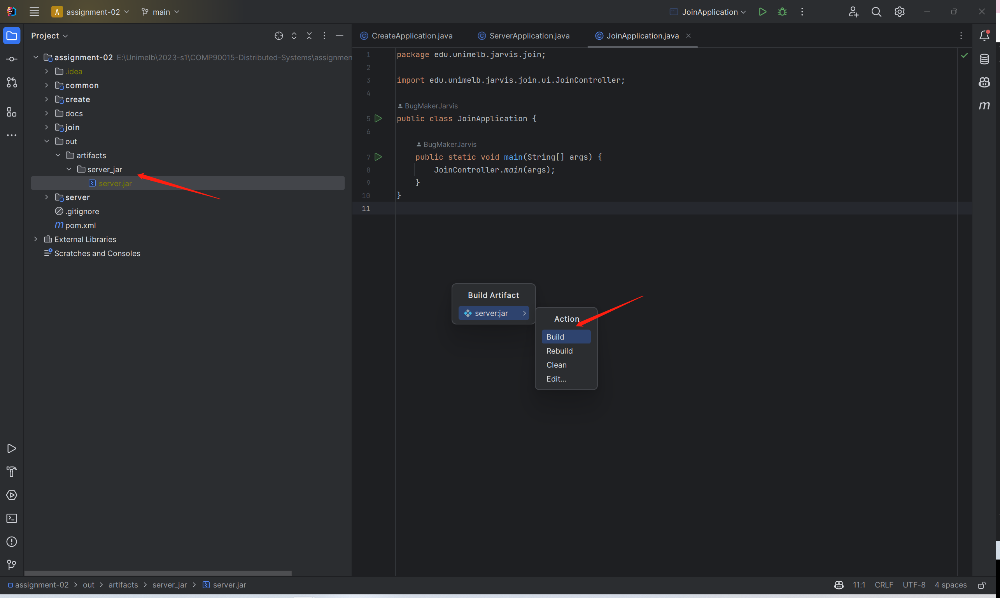

Wish you all the best in your studies!